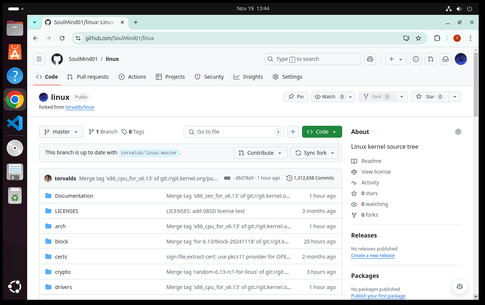
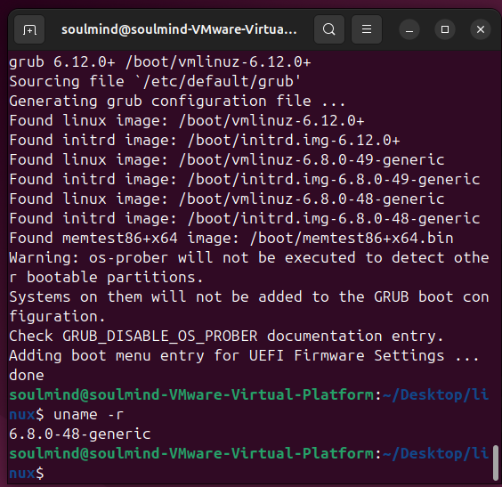
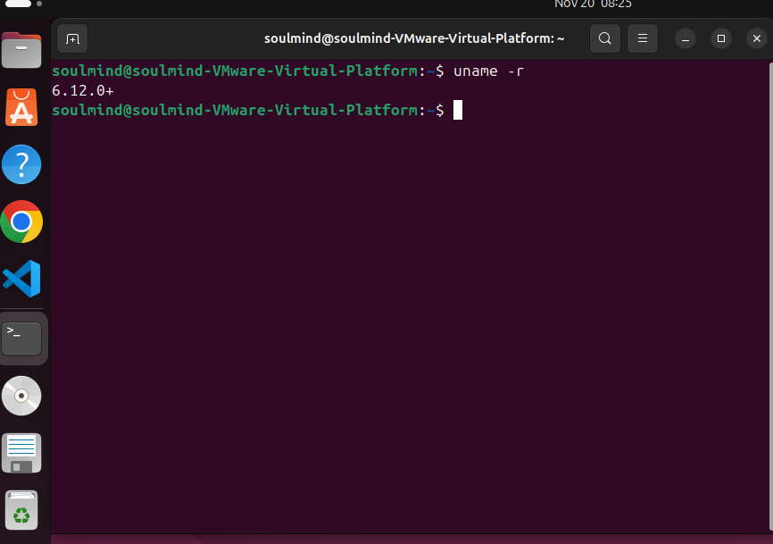
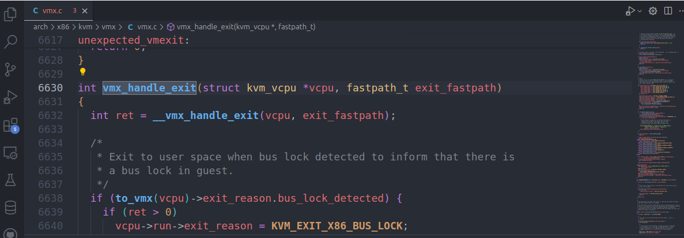
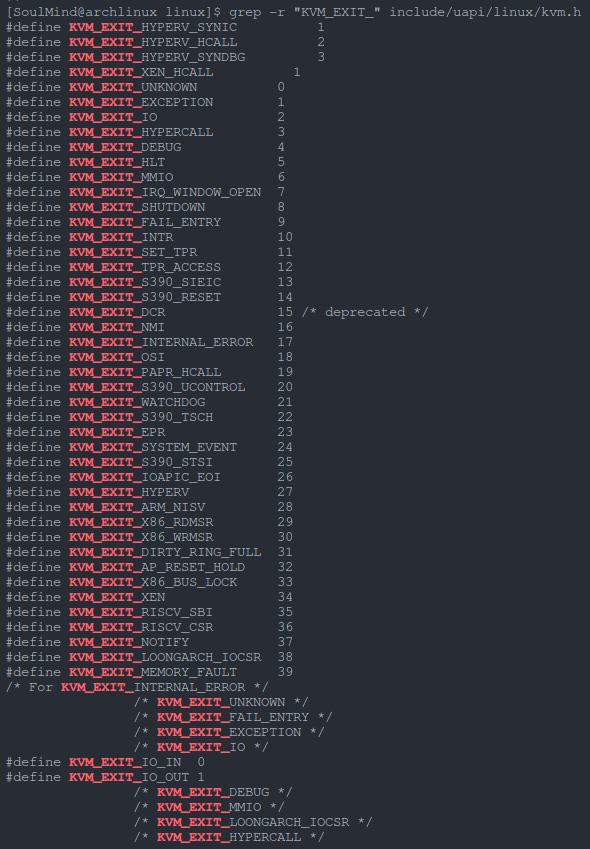
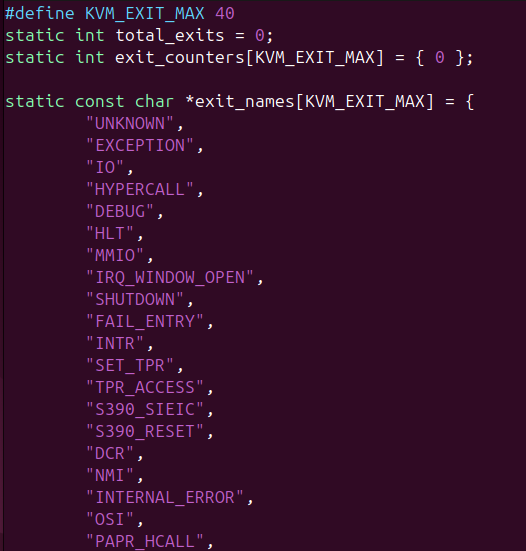
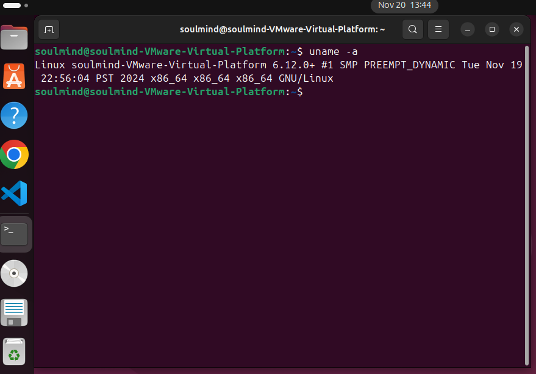
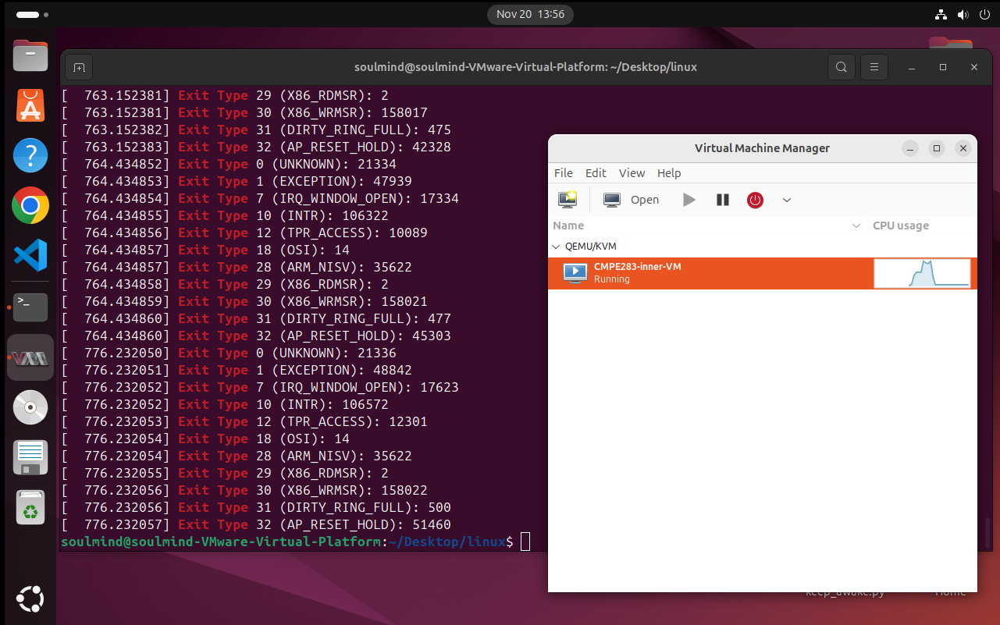
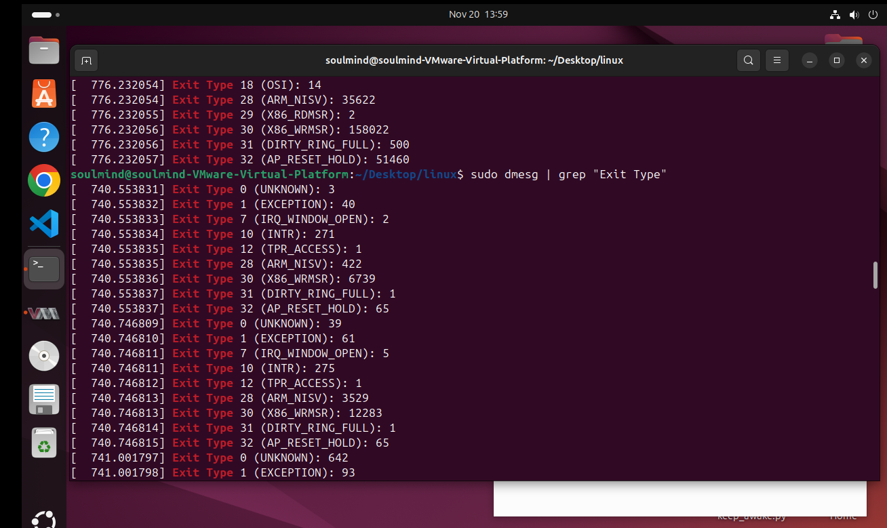

# CMPE283 HW2

Team Members: Tingfei Gu, Ranyi Zhang

# Questions:

# 1. Responsibility Distribution:

Tingfei Gu: Worked mainly on step 1 (cloning the fork into the outer VM, 
configuring the linux kernel build using the cloned tree, building the kernel 
plus any required initrd/initramfs) and step 3.

Ranyi Zhang: Worked mainly on step 2 (locating the exit handler function in KVM,
incrementing the per-exit-type counter, printing the exit types and numbers, 
building and installing the new kernel containing the changes, reebooting the outer VM)

# 2. Procedure Description:

# Step1 kernel build test
- Fork the linux repository
- 
    - Clone the forked repository to the outer VM
    - Configure a linux kernel build
        - Install build packages including base-devel ncurses bc flex bison perl python glibc zlib openssl
        - Copy the current system’s kernel configuration (under /boot) to the linux source code directory
        - Modify the configuration:
            - CONFIG_SYSTEM_REVOCATION_KEYS = “”
            - CONFIG_SYSTEM_TRUSTED_KEYS=””
        - Generate config file
            - `make oldconfig` and press enter all the way down
    - Build the kernel
        - Run `sudo make -j$(nproc)`
    - Install the kernel
        - Run:
            - `sudo make modules_install`
            - `sudo make install`
        - Kernel version before reboot: 6.8.0-48
        - 
    - Reboot the outer VM
        - Kernel version after reboot: 6.12.0+
        - 
        - The kernel is installed
# Step2 editing the kernel KVM source code and adding the counters for the various types of exits

- Locate the exit handler function in KVM
- 
- At the start of the function, increment a per-exit-type counter and global total exit counter
    - In `vmx.c`, add these code:
        ```
        #define KVM_EXIT_MAX 77
        static uint64_t total_exits = 0;
        static uint64_t exit_counters[KVM_EXIT_MAX] = {0};
        ```
    - Count total exit types
    - 
        - There are 40 exit types
        - Add the following code:
        - 
          declare the global variable and each exit name
        - keep track of the exit count and print when necessary
    - Reboot
    - 
- The kernel name is changed
# Step3
- Run `dmesg | grep “Exit Type”`
- 
- 

